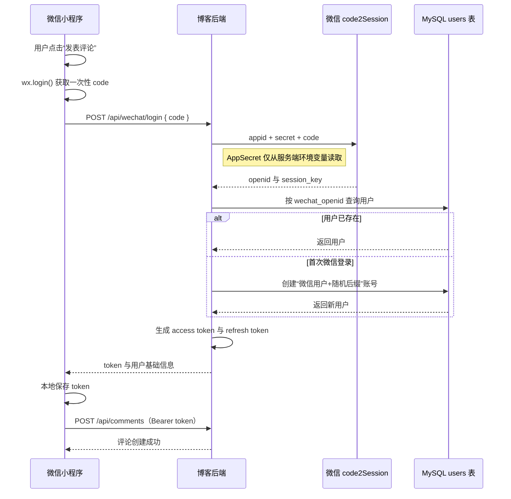

# 微信小程序博客设计

## 目标

完成 `blogweixin` 微信小程序前台，复用现有博客后端的文章、分类、点赞和评论接口。小程序提供浏览文章、按分类浏览、阅读文章、匿名点赞和微信登录后评论的能力。

## 范围

### 包含

- 首页文章信息流与下拉加载。
- 分类页与分类文章列表。
- 文章详情、Markdown 正文渲染、匿名点赞与评论列表。
- 发表评论时触发微信登录。
- 后端新增微信登录接口和用户微信身份字段。

### 不包含

- 小程序后台管理、文章发布、用户资料页、邮箱登录、注册、密码找回。
- 点赞去重、取消点赞和点赞记录。
- 现有文章、分类、点赞、评论接口的业务变更。

## 页面设计

采用白底、轻边框、信息卡片布局，使用小程序原生页面与组件。

1. 首页：展示文章封面、标题、摘要、分类、发布时间和统计数据；支持下拉刷新与触底加载。
2. 分类页：展示分类名称、描述与文章数；点击进入分类文章列表。
3. 分类文章页：复用文章卡片展示该分类文章，支持分页加载。
4. 文章详情页：展示标题、元信息、正文、点赞按钮和评论区。Markdown 通过小程序 Markdown 组件渲染。

## 小程序架构

- `services/request.js`：统一处理基础地址、请求方法、响应信封、加载状态与错误信息。
- `services/api.js`：集中声明文章、分类、点赞、评论和微信登录请求。
- `utils/auth.js`：读取、保存和清除 JWT；在评论前确保登录。
- `components/article-card`：文章列表卡片。
- `components/comment-list`：评论列表与评论输入区域。
- 各页面仅处理页面状态、滚动和用户交互，不直接拼接 HTTP 请求。

请求地址先使用开发地址 `http://124.223.175.138:80`，在 `services/config.js` 中集中配置。正式发布前替换为已配置微信合法域名的 HTTPS 地址。

## 微信登录

新增 `POST /api/wechat/login`，请求体为：

```json
{ "code": "wx.login 返回的一次性 code" }
```

处理流程：

1. 小程序仅在用户提交评论时调用 `wx.login()`。
2. 小程序将 code 发送给后端。
3. 后端使用服务端环境变量中的微信 AppID 和 AppSecret 调用微信 code2Session 服务。
4. 后端以 `openid` 查询用户；不存在时创建昵称为“微信用户+随机后缀”的正常用户。
5. 后端返回现有 JWT 格式的 access token、refresh token 和用户基础信息。
6. 小程序保存 token，并用 `Authorization: Bearer <token>` 调用既有 `POST /api/comments`。

小程序不保存、传输或打包 AppSecret。

### 微信登录流程图



`session_key` 不写入用户表、不返回小程序，也不记录到日志。微信接口失败、code 失效或用户状态被禁用时，后端返回现有错误响应，小程序停止发表评论并提示用户重新尝试。

## 数据模型

在 `users` 表和 `models.User` 新增：

- `wechat_openid`：可空字符串、唯一索引。

现有项目的 GORM `AutoMigrate` 负责增加该字段。邮箱账号保持原有行为，不与微信账号自动合并。

## 既有接口复用

- `GET /api/articles`
- `GET /api/articles/detail?id=:id`
- `GET /api/categories`
- `GET /api/categories/articles?category_id=:id&page=:page`
- `POST /api/articles/like`
- `GET /api/comments?article_id=:id&page=:page`
- `POST /api/comments`

点赞不传认证信息，可重复调用，且不支持取消。评论仍使用现有默认通过状态并即时显示的行为。

## 失败处理

- 请求失败显示可理解的错误提示，并保留页面已有内容。
- 评论时微信登录失败或用户拒绝登录，不创建评论。
- JWT 失效时清除本地登录态；用户再次评论时重新走微信登录。
- Markdown 渲染失败时显示原始文本，不阻塞文章阅读。

## 验收标准

- 首页、分类、分类文章和详情页能正确展示后端数据。
- 点赞无需登录，连续点击会按现有后端规则累计次数。
- 未登录用户发布评论时会完成微信登录并成功提交；已登录用户直接提交。
- 首次微信登录仅创建一个用户，后续同一 openid 能复用该用户。
- AppSecret、数据库密码和其他凭据不出现在小程序源码、提交记录或日志中。
- 小程序可在微信开发者工具中编译通过；后端 Go 测试和构建通过。
